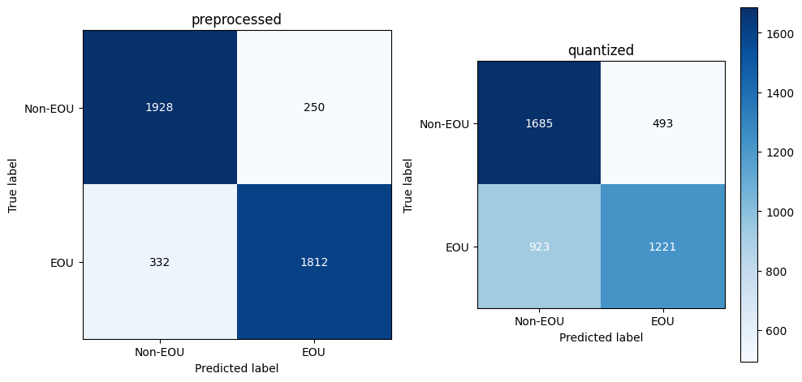

# turnsense
A lightweight end-of-utterance detection model fine-tuned on SmolLM2-135M, optimized for Raspberry Pi and low-power devices.

🚀 Supports: ONNX (for transformers & ONNX Runtime)
📦 **Model Repository**: [Hugging Face - latishab/turnsense](https://huggingface.co/latishab/turnsense)

## 🛠 Model Details
Model: SmolLM2-135M fine-tuned for end-of-utterance detection.
Size: ~135M parameters (optimized for efficiency).
Formats:
- ONNX (for Hugging Face transformers & ONNX Runtime)

## 📊 Performance
Based on our evaluation:
- Preprocessed model: 85% accuracy, 0.93 AUC (ROC)
- Quantized model: 63% accuracy, 0.75 AUC (ROC)

The quantized model has a bias toward Non-EOU predictions, which is beneficial when integrated with Voice Activity Detection (VAD) as it reduces the risk of premature interruptions.



## 🔹 Installation
### ONNX Runtime

ONNX (Open Neural Network Exchange) is an open standard for machine learning models that allows models to be transferred between different frameworks.

#### Install dependencies
```
pip install transformers onnxruntime numpy
```

### Run inference
```python
import onnxruntime
import numpy as np
from transformers import AutoTokenizer

# Load tokenizer and model
tokenizer = AutoTokenizer.from_pretrained("latishab/turnsense")
session = onnxruntime.InferenceSession("model_quantized.onnx")  # or model_preprocessed.onnx

# Prepare input text with 3 turns of conversation context
input_text = (
    "<|user|> Can you help me with my math homework? <|im_end|> "
    "<|assistant|> Of course! What kind of math problem are you working on? <|im_end|> "
    "<|user|> Wait, wait, so if I do that, then… hold on, I think I messed up the— <|im_end|>"
)

inputs = tokenizer(
    input_text,
    return_tensors="np",
    truncation=True,
    padding=True,
    max_length=128
)

# Run inference
ort_inputs = {
    'input_ids': inputs['input_ids'].astype(np.int64),
    'attention_mask': inputs['attention_mask'].astype(np.int64)
}
output = session.run(None, ort_inputs)[0]

# Get EOU probability
# If output has shape [batch_size, 2], take probability for class 1 (EOU)
if len(output.shape) > 1 and output.shape[1] == 2:
    eou_probability = float(output[0, 1])
else:
    # If output has shape [batch_size] (single probability)
    eou_probability = float(output[0])

print(f"End-of-utterance probability: {eou_probability:.4f}")
```

## 🔍 Usage Recommendations
- For production systems, we recommend using the quantized model with VAD integration
- Suggested adaptive thresholds for the quantized model:
  * Base threshold: 0.65-0.70 (higher than the standard 0.5)
  * Short utterances (1-2 words): +0.10-0.15 to threshold
  * Hesitations and fillers: +0.10 to threshold
  * Complete utterances with punctuation: -0.15 to threshold
  * Expressions of uncertainty: +0.05 to threshold

- VAD integration strategy:
  * For probabilities <0.40: Require longer VAD silence (500-700ms)
  * For probabilities 0.40-0.70: Standard VAD silence (300-500ms)
  * For probabilities >0.70: Shorter VAD silence (100-300ms)
  * Never trigger EOU based solely on model prediction without some VAD confirmation

## 🤝 Contributions

Contributions to improve turnsense are welcome! Here are some ways you can help:

- Testing the model in different conversational contexts and reporting results
- Improving documentation and examples
- Adding support for additional model formats (GGUF, TensorRT, etc.)
- Creating language-specific fine-tuned versions
- Developing integration examples with popular speech recognition systems
- Expanding the labeled dataset with more conversational examples
  * Please ensure examples include at least 3 turns of context for optimal performance
  * Diverse conversation styles (casual, formal, technical) are especially valuable

If you'd like to contribute, please feel free to open an issue or submit a pull request.

## 🔮 Future Work

We're actively working on several improvements:

- GGUF format support for llama.cpp integration
- Targeted data augmentation for specific error patterns
- Hybrid system using both preprocessed and quantized models for improved accuracy
- Domain-specific fine-tuning options
- Improved handling of hesitations and filler words
- Multi-language support
- Integration examples with popular VAD systems
- Benchmarking on various edge devices
